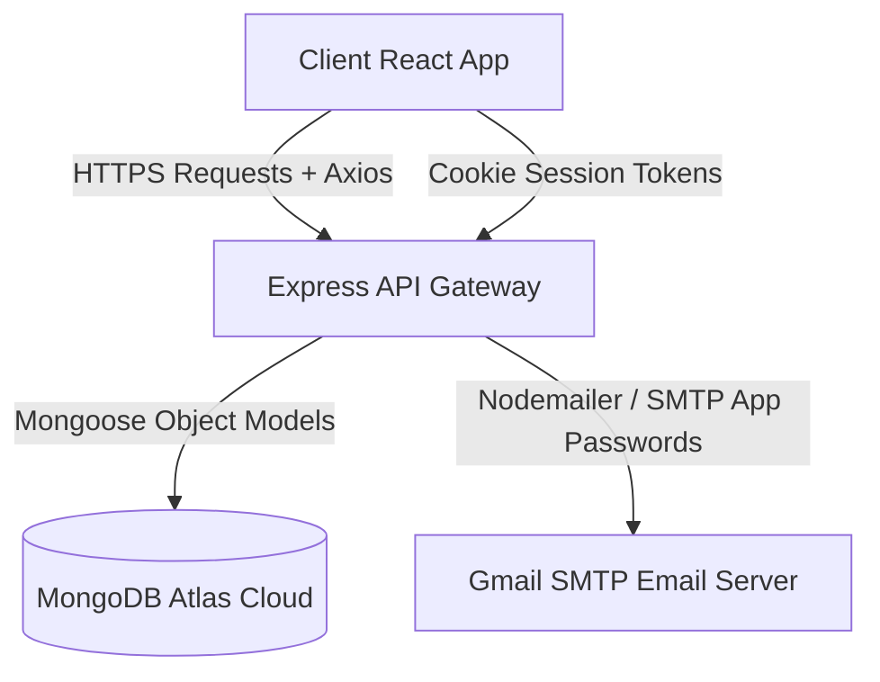

# Hisaab-Kitab 🪙 (MERN Expense Tracker & Community Platform)

Welcome to **Hisaab-Kitab** (formerly ExpenseTracker), a fully-featured, premium wealth-tracking and financial discipline application built on the MERN stack. Hisaab-Kitab helps users track budgets, review visual spending analytics, import statements, follow other users, and rank on a global savings leaderboard.

---

## 🏗️ Architecture Overview

Hisaab-Kitab is built as a decoupled Client-Server architecture:
*   **Frontend**: A responsive Single Page Application (SPA) built using **React** and **Vite**, styled with **Tailwind CSS**, and hosted on **Vercel**.
*   **Backend**: A RESTful API built on **Node.js** and **Express.js**, hosted on **Render**.
*   **Database**: A cloud-hosted **MongoDB Atlas** database managing relational collections via **Mongoose**.



---

## 🚀 Key Features

1.  **Immersive Onboarding**:
    *   An elegant, custom-designed **SplashScreen.jsx** displays a premium gold Indian Rupee loader animation for 3 seconds before routing users to authenticate.
2.  **Secure Authentication**:
    *   Register & Login endpoints encrypt passwords using `bcryptjs`.
    *   State is managed through dual secure token system: **Access Token** (stored via cookie with short expiration) and **Refresh Token** (stored in DB/cookie for persistent sessions).
3.  **Comprehensive Transactions Management**:
    *   Interactive records interface where users can add, edit, search, filter, and delete entries.
    *   Transactions are strictly categorized: *Food, Travel, Shopping, Education, Entertainment, Health, Utilities, Other*.
4.  **Flexible Budget Control**:
    *   Set monthly limits for individual expense categories.
    *   Visual progress bars track consumption. The app automatically flags warnings when a budget threshold is exceeded.
5.  **Interactive Community features**:
    *   **Leaderboard**: Connect and view a global ranking of top-saving users based on their financial discipline.
    *   **Follow System**: Search public profiles, follow/unfollow users, and monitor social feeds.
6.  **Advanced Analytics**:
    *   Detailed graphical charts representing Income vs. Expense ratios.
    *   Category distribution charts and chronological transaction timelines.
7.  **Bulk CSV Import/Export**:
    *   Upload external bank statements and parse them dynamically into standard transactions.
8.  **Automated Notifications**:
    *   In-app alerts for system events, follows, and budget thresholds.
    *   Weekly summary email delivery capability.

---

## 🛠️ Technology Stack & Dependencies

### Frontend (`expense-tracker/`)
*   **Vite React**: High-performance React build toolchain.
*   **React Router DOM (v6)**: Handles client-side navigation.
*   **Tailwind CSS**: Modern utility-first styling for premium responsive layout, glassmorphism cards, and dark theme support.
*   **Axios**: Performs API requests with:
    *   Global request interceptor to rewrite local routes to deployed Render endpoints in production.
    *   Global `withCredentials = true` default to enable secure cross-origin HTTP-only cookie synchronization.
*   **Chart.js & React-Chartjs-2**: Renders dynamic canvas analytical graphs (bar, doughnut, and line charts).
*   **Lucide React**: Custom vector SVG icons.
*   **Framer Motion**: Smooth, performance-tuned micro-interactions and route animations.

### Backend (`backend/`)
*   **Express.js**: Backend router routing middlewares and controllers.
*   **Mongoose**: Direct object document mapping (ODM) for database models.
*   **Cookie Parser**: Extracts cookie headers and populates `req.cookies`.
*   **JSON Web Token (JWT)**: Signs and decodes secure auth claims.
*   **BcryptJS**: Performs robust 10-salt password hashing.
*   **CORS**: Dynamic cross-origin resource sharing middleware linked to `process.env.CORS_ORIGIN`.
*   **Nodemailer**: Connects to SMTP services to dispatch automated emails.
*   **Multer**: Handles multipart form data for uploading user profile avatars.

---

## 🗄️ Database Schemas (MongoDB / Mongoose)

### 1. User Schema (`User`)
Stores authorization credentials, preferences, monthly budgets, and profile assets.
```javascript
const userSchema = new mongoose.Schema({
  fullName: { type: String, required: true, trim: true },
  username: { type: String, required: true, unique: true, lowercase: true, trim: true },
  email: { type: String, required: true, unique: true, lowercase: true, trim: true },
  password: { type: String, required: true },
  avatar: { type: String, default: "" },
  refreshToken: { type: String },
  settings: {
    currency: { type: String, default: "INR" },
    language: { type: String, default: "en" },
    compactMode: { type: Boolean, default: false },
    animationsEnabled: { type: Boolean, default: true },
    dateFormat: { type: String, default: "DD/MM/YYYY" },
    notifWeekly: { type: Boolean, default: true },
    notifBudget: { type: Boolean, default: true },
    notifLeaderboard: { type: Boolean, default: false },
    notifMilestones: { type: Boolean, default: false },
    notifEmail: { type: Boolean, default: true },
    notifPush: { type: Boolean, default: false },
    profilePublic: { type: Boolean, default: true },
    showOnLeaderboard: { type: Boolean, default: true },
    shareAnalytics: { type: Boolean, default: false },
    sessionTimeout: { type: String, default: "30" }
  },
  budgets: { type: Map, of: Number, default: {} }
}, { timestamps: true });
```

### 2. Transaction Schema (`Transaction`)
Maintains granular history of financial operations.
```javascript
const transactionSchema = new mongoose.Schema({
  title: { type: String, required: true, trim: true },
  amount: { type: Number, required: true, min: 1 },
  type: { type: String, enum: ["income", "expense"], required: true },
  category: { 
    type: String, 
    required: true, 
    enum: ["Food", "Travel", "Shopping", "Education", "Entertainment", "Health", "Utilities", "Other"]
  },
  date: { type: Date, default: Date.now },
  note: { type: String, trim: true },
  owner: { type: mongoose.Schema.Types.ObjectId, ref: "User", required: true, index: true }
}, { timestamps: true });

// Compound Indexing for optimal transaction pagination querying
transactionSchema.index({ owner: 1, date: -1 });
```

### 3. Follow Schema (`Follow`)
Models follow networks with constraint integrity.
```javascript
const followSchema = new mongoose.Schema({
  follower: { type: mongoose.Schema.Types.ObjectId, ref: "User", required: true, index: true },
  following: { type: mongoose.Schema.Types.ObjectId, ref: "User", required: true, index: true }
}, { timestamps: true });

// Compound Unique Constraint prevents double-following
followSchema.index({ follower: 1, following: 1 }, { unique: true });
```

### 4. Notification Schema (`Notification`)
Handles alerts regarding activity, trends, and safety.
```javascript
const notificationSchema = new mongoose.Schema({
  recipient: { type: mongoose.Schema.Types.ObjectId, ref: "User", required: true, index: true },
  sender: { type: mongoose.Schema.Types.ObjectId, ref: "User", required: true },
  type: { type: String, enum: ["follow", "budget", "trend", "info"], required: true },
  title: { type: String, required: true },
  message: { type: String, required: true },
  read: { type: Boolean, default: false, index: true }
}, { timestamps: true });
```

---

## 📡 API Routing Catalog

### Users Endpoint `/api/v1/users`
*   `POST /register` — Instantiates user record.
*   `POST /login` — Verifies credentials, issues cookies.
*   `POST /logout` — Clears JWT tokens from cookies & database (Requires Auth).
*   `POST /refresh-token` — Regenerates expired JWTs.
*   `GET /current-user` — Returns detailed session profile (Requires Auth).
*   `PUT /update-account` — Updates name/email (Requires Auth).
*   `PATCH /change-password` — Updates login password (Requires Auth).
*   `PATCH /update-settings` — Updates configuration settings (Requires Auth).
*   `PATCH /update-budgets` — Updates category budget mappings (Requires Auth).
*   `GET /p/:username` — Returns details of a public user (Requires Auth).
*   `POST /send-test-email` — Dispatches test SMTP mail (Requires Auth).
*   `DELETE /delete-account` — Deletes profile and all owner assets (Requires Auth).

### Transactions Endpoint `/api/v1/transactions`
*   `GET /` — Fetches paginated transaction records list (Requires Auth).
*   `POST /` — Appends a transaction (Requires Auth).
*   `PUT /:id` — Updates a transaction by ID (Requires Auth).
*   `DELETE /:id` — Deletes a transaction by ID (Requires Auth).
*   `POST /bulk` — Processes bulk CSV upload list (Requires Auth).
*   `DELETE /clear-all` — Resets all user transaction history (Requires Auth).

### Leaderboard Endpoint `/api/v1/leaderboard`
*   `GET /` — Compiles savings ranking lists (Requires Auth).

### Follow Endpoint `/api/v1/follow`
*   `POST /follow-user` — Follows user (Requires Auth).
*   `POST /unfollow-user` — Unfollows user (Requires Auth).
*   `GET /followers/:userId` — Returns followers list (Requires Auth).
*   `GET /following/:userId` — Returns following list (Requires Auth).

### Notifications Endpoint `/api/v1/notifications`
*   `GET /` — Fetches active notification lists (Requires Auth).
*   `PATCH /mark-read/:id` — Flags a notification as read (Requires Auth).
*   `PATCH /mark-all-read` — Flags all active alerts as read (Requires Auth).
*   `DELETE /delete/:id` — Removes warning by ID (Requires Auth).

---

## ⚙️ Configuration Setup

### Backend `.env` Template
Create a `.env` file in your `backend/` directory:
```env
PORT=8000
MONGODB_URI=mongodb+srv://<username>:<password>@cluster.mongodb.net
DB_NAME=EXPENSETRACKER

ACCESS_TOKEN_SECRET=YourSuperLongAccessTokenSecretSignatureKeyHere
ACCESS_TOKEN_EXPIRY=1d
REFRESH_TOKEN_SECRET=YourSuperLongRefreshTokenSecretSignatureKeyHere
REFRESH_TOKEN_EXPIRY=7d

GMAIL_USER=your_gmail_address@gmail.com
GMAIL_APP_PASSWORD=your_16_char_google_app_password
EMAIL_FROM_NAME=Hisaab-Kitab

CORS_ORIGIN=http://localhost:5173
NODE_ENV=development
```

### Frontend `.env.production` Template
Create a `.env.production` file inside `expense-tracker/` so Vite loads it automatically when building for Vercel:
```env
# Deployed Production Backend URL
VITE_API_URL=https://hisaab-kitaab-70qv.onrender.com
```

---

## 💻 Local Development Workflow

Follow these instructions to run the application locally:

### 1. Prerequisite Checklist
*   Install **NodeJS** (LTS recommendation).
*   Ensure a local instance of **MongoDB** is running or access to a **MongoDB Atlas Cluster** is configured.

### 2. Startup Backend
```bash
cd backend
npm install
npm run dev
```
The server will boot on `http://localhost:8000`.

### 3. Startup Frontend
```bash
cd expense-tracker
npm install
npm run dev
```
The Vite development server will boot on `http://localhost:5173`. Any requests to local backend APIs are intercepted and directed to localhost.

---

## 🌐 Production Deployment Guide

### A. Deploy Backend to Render
1. Create a new **Web Service** on Render.
2. Link your GitHub repository `https://github.com/amay-agrawal/Hisaab-kitaab`.
3. Set **Root Directory** to `backend`.
4. Configure commands:
   * **Build Command**: `npm install`
   * **Start Command**: `npm start`
5. Navigate to **Environment Variables** and add all values in the Backend Env Template, replacing `CORS_ORIGIN` with your Vercel URL and `NODE_ENV` with `production`.

### B. Deploy Frontend to Vercel
1. Create a new project on Vercel and connect your `Hisaab-kitaab` repo.
2. Set **Root Directory** to `expense-tracker`.
3. Vercel automatically runs the Vite build (`npm run build`).
4. Click **Deploy**. Vercel will build, read the local `.env.production` file to set `VITE_API_URL`, and route endpoints cleanly via our custom `vercel.json` SPA configuration rules.
